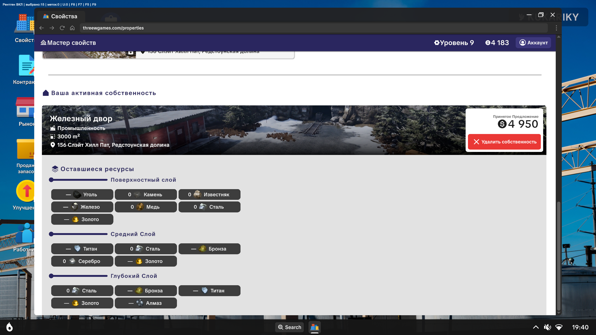

# Ore Factory Squad — Resource X-Ray

MelonLoader mod that adds **x-ray markers** for ore nodes underground. Choose which ores to highlight; markers show through terrain with name + distance.

**[Русская версия ↓](#русская-версия)**

---

> **Maintenance notice:** No further updates are planned for the **current game version**. The mod is considered feature-complete for Ore Factory Squad as it is today. If the game receives a major update, development may resume.

## Screenshots

| In-game ESP | Property ore list |
|-------------|-------------------|
|  |  |

| Ore menu (F8) | Help inside menu | Compact HUD |
|---------------|------------------|---------------|
|  |  |  |

## Support the developer

If this mod helped you, you can leave a tip:

**[DonationAlerts — G3ntEZ](https://www.donationalerts.com/r/g3ntez)**

---

## Features

- See selected ores through walls (ESP-style markers)
- Per-ore toggle: enable only what you need
- **Scrap** and **Antique** categories in the menu
- Finds ore in **hidden rooms** (inactive objects + node pieces inside rocks)
- **Low performance mode** (F5) for weak PCs — slower rescan
- **All ore visible at any distance** — nothing cut off by range limits
- **One label per vein** (e.g. `Gold x12`) — not per rock piece
- **Permanent markers** (U) — place/remove waypoints on the map
- **Clear all U markers** (I)
- **Reload ore markers** (F4) — fix glitches when rocks/ore desync
- **Fly / noclip** (F3) — free flight through walls (WASD + Space/Ctrl, Shift = faster)
- Proper item names via game I2 localization (Bronze, Steel, Titanium, etc.)
- Language modes: **Auto** (follows game I2 language), **RU**, **EN** — ore names follow the mod language too
- In-menu **Help** with **Back**, mouse cursor, scroll wheel navigation
- Settings are saved between sessions

## Requirements

| Soft | Link |
|------|------|
| Game | [Ore Factory Squad on Steam](https://store.steampowered.com/app/4210580/Ore_Factory_Squad/) |
| Mod loader | [MelonLoader](https://github.com/LavaGang/MelonLoader/releases) **v0.7.3+** (Il2Cpp / net6) |

## Install (players)

1. Install **MelonLoader** into the game folder (select `Ore Factory Squad.exe`).
2. Download `OFSResourceXRay.dll` from the latest [Release](../../releases/latest).
3. Put the DLL into:
   ```
   <GameFolder>\Mods\OFSResourceXRay.dll
   ```
   Example:
   ```
   C:\Program Files (x86)\Steam\steamapps\common\Ore Factory Squad\Mods\
   ```
4. Launch the game. MelonLoader console should list **Resource X-Ray**.

> First MelonLoader launch may take longer while it generates Il2Cpp assemblies.

## Controls

| Key | Action |
|-----|--------|
| **F8** | Open / close ore menu |
| **↑ / ↓** or **W / S** / **mouse wheel** | Move selection |
| **Enter / Space / E** | Toggle selected ore ON/OFF |
| **Mouse click** | Toggle ore / press menu buttons |
| **1** | Enable all ores |
| **2** | Disable all ores |
| **L** | Language: Auto → RU → EN → Auto |
| **F7** | Master ESP on/off |
| **F6** | Refresh ore list / rescan |
| **F4** | Reload ore markers (fix desync / bugs) |
| **F3** | Fly / noclip on/off |
| **F5** | Low performance mode on/off |
| **F10** / **Help** | Open help inside the F8 menu |
| **U** | Place / remove permanent marker |
| **I** | Clear all permanent (U) markers |
| **Esc** | Close menu |

## Language

- **Auto** — matches the game language (Russian / English via I2 Localization)
- **RU** / **EN** — force mod UI language  
Preference is stored in MelonLoader preferences (`ResourceXRay` → `Language`).

## Build from source (developers)

1. Install MelonLoader on the game and run it once (creates `MelonLoader\Il2CppAssemblies`).
2. Install [.NET 6 SDK](https://dotnet.microsoft.com/download/dotnet/6.0).
3. Edit `OFSResourceXRay.csproj` — set `GameDir` to your game path.
4. Build:
   ```bash
   dotnet build -c Release
   ```
5. Output DLL is copied to `<GameDir>\Mods\` automatically.

## Disclaimer

This is an unofficial fan mod, not affiliated with threeW or PlayWay. Use at your own risk. Single-player / private use recommended; respect the game’s multiplayer rules.

## License

MIT — see [LICENSE](LICENSE).

---

# Русская версия

MelonLoader-мод с **рентгеном руд**: метки сквозь землю, выбор нужных ресурсов, имя и дистанция.

> **Важно:** для **текущей версии игры** обновлений **больше не планируется**. Мод считается завершённым. Если игра сильно обновится — возможно продолжим разработку.

## Скриншоты

| Рентген в игре | Список руд на участке |
|----------------|----------------------|
|  |  |

| Меню руд (F8) | Инструкция в меню | Компактный HUD |
|---------------|-------------------|----------------|
|  |  |  |

## Поддержать разработчика

Если мод помог — можно оставить донат:

**[DonationAlerts — G3ntEZ](https://www.donationalerts.com/r/g3ntez)**

---

## Возможности

- Метки выбранных руд сквозь стены
- Включение/выключение каждой руды отдельно
- Категории **Лом** и **Антиквариат** в меню
- Поиск руды в **скрытых комнатах** (неактивные объекты + куски внутри камня)
- **Экономный режим** (F5) для слабых ПК — реже перескан
- **Вся руда на карте** — без ограничения по дистанции
- **Одна метка на жилу** (например `Золото x12`), а не на каждый камень
- **Постоянные метки** (U) — ставить и снимать точки на карте
- **Очистить все метки** (I) — убрать все точки U разом
- **Перезагрузка меток** (F4) — если камень/руда глючит
- **Полёт / noclip** (F3) — летать сквозь стены (WASD + Space/Ctrl, Shift = быстрее)
- Корректные названия через I2 игры (Бронза, Сталь, Титан и т.д.)
- Язык: **Авто** (как в игре), **RU**, **EN** — названия руд тоже переключаются
- **Помощь** внутри меню с кнопкой **Назад**, курсор мыши, колесо прокрутки
- Настройки сохраняются

## Что нужно

| Что | Ссылка |
|-----|--------|
| Игра | [Ore Factory Squad в Steam](https://store.steampowered.com/app/4210580/Ore_Factory_Squad/) |
| Загрузчик | [MelonLoader](https://github.com/LavaGang/MelonLoader/releases) **v0.7.3+** |

## Установка

1. Установи **MelonLoader** в папку игры (укажи `Ore Factory Squad.exe`).
2. Скачай `OFSResourceXRay.dll` из последнего [Release](../../releases/latest).
3. Положи файл сюда:
   ```
   <ПапкаИгры>\Mods\OFSResourceXRay.dll
   ```
4. Запусти игру. В консоли MelonLoader должен появиться **Resource X-Ray**.

> Первый запуск с MelonLoader может быть дольше обычного.

## Управление

| Клавиша | Действие |
|---------|----------|
| **F8** | Меню руд |
| **↑ / ↓** или **W / S** / **колесо мыши** | Выбор строки |
| **Enter / Space / E** | Вкл/выкл руду |
| **Клик мышью** | То же + кнопки меню |
| **1** | Включить все |
| **2** | Выключить все |
| **L** | Язык: Авто → RU → EN |
| **F7** | Рентген вкл/выкл |
| **F6** | Обновить список |
| **F4** | Перезагрузить метки руд (если баг) |
| **F3** | Полёт / noclip вкл/выкл |
| **F5** | Экономный режим вкл/выкл |
| **F10** / **Помощь** | Инструкция внутри меню F8 |
| **U** | Поставить / убрать постоянную метку |
| **I** | Очистить все метки U |
| **Esc** | Закрыть меню |

## Язык

- **Авто** — как язык игры  
- **RU** / **EN** — вручную  

## Сборка из исходников

1. Поставь MelonLoader и один раз запусти игру.
2. Установи [.NET 6 SDK](https://dotnet.microsoft.com/download/dotnet/6.0).
3. В `OFSResourceXRay.csproj` укажи свой `GameDir`.
4. `dotnet build -c Release`

## Отказ от ответственности

Неофициальный фан-мод, не связан с threeW / PlayWay. Используй на свой риск.

## Лицензия

MIT — см. [LICENSE](LICENSE).
